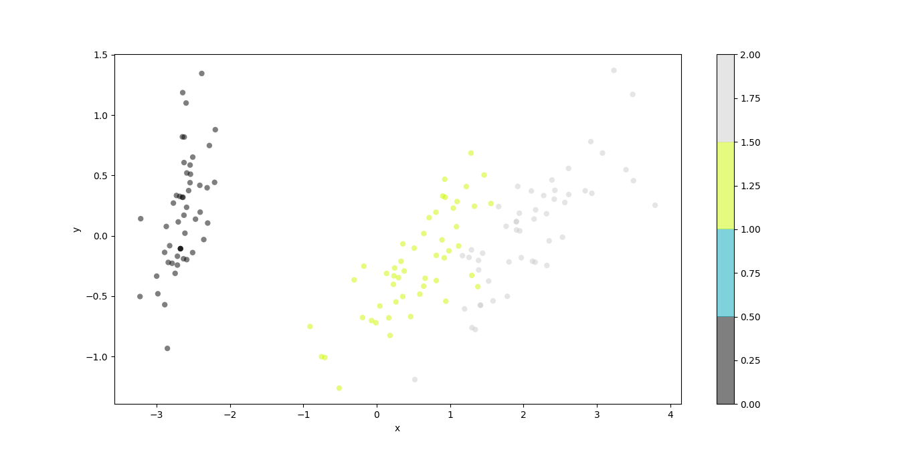
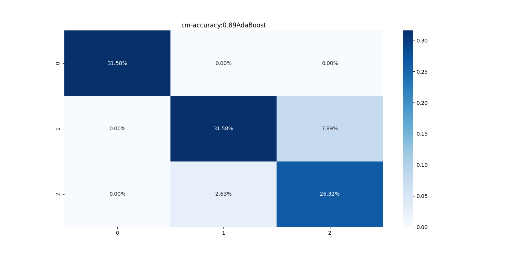
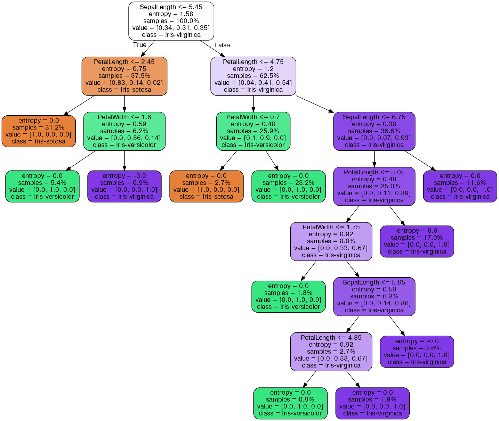
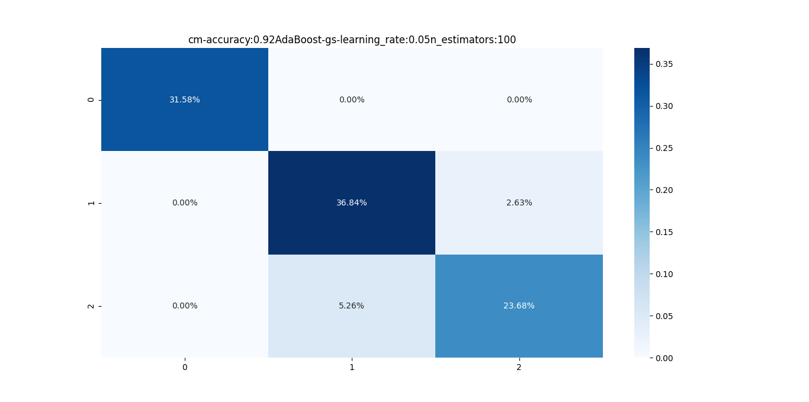
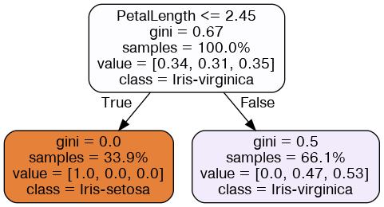

# Directory Structure

```text
.
├── api_test.py
├── app.py
├── data
│   └── iris_data.csv
├── docker-compose.yml
├── Dockerfile
├── figures
│   ├── adaboost-graph-gs-.png
│   ├── adaboost-graph-.png
│   ├── Figure_cm_cm-accuracy:0.89AdaBoost.png
│   ├── Figure_cm_cm-accuracy:0.92AdaBoost-gs-.png
│   └── Figure_iris.png
├── graph
│   ├── adaboost-graph-.dot
│   └── adaboost-graph-gs-.dot
├── README.md
├── requirements.txt
├── run.py
├── utils
│   ├── data.py
│   ├── __init__.py
│   ├── model.py
│   └── plot.py
└── weights
    ├── AdaBoost-gs-0151et.pkl
    ├── AdaBoost-gs-171iur.pkl
    ├── AdaBoost-gs-281xu4.pkl
    └── AdaBoost-hgzmu.pkl

5 directories, 23 files
```
# Command Line Interface
```text
usage: run.py [-h] [--load LOAD] [--gs GS]

optional arguments:
  -h, --help   show this help message and exit
  --load LOAD  True: Load trained model False: Train model default: True
  --gs GS      Find optimal parameters with 10-Fold GridSearchCV
```

# Data
```text
Features: sepalLength, sepalWidth, petalLength, petalWidth
```
```text
Labels: Iris-setosa,Iris-versicolor,Iris-virginica
```

# Plot the Iris Train & Test data with 2D PCA


# Install Graphviz to Visualize DecisionTree
```shell
 sudo apt install graphviz
 ```


# AdaBoost Parameters
```text
n_estimators: 50, 100, 200
```
```text
learning_rate: 0.01, 0.05, 0.1, 0.3, 1
```
```text
base_estimator: DecisionTreeClassifier
```
```text
criterion: entropy
```
```text
max_features: sqrt
```
# Additional CLI parameters
```text
gs: yes,no
```
```text
load: yes,no
```

# Train the AdaBoost model

## Experiment 1

### Parameters

```text
base_estimator: DecisionTreeClassifier
```

```text
criterion: entropy
```

```text
max_features: sqrt
```
```text
n_estimators: 100
```

```text
learning_rate: 1
```

### CLI

```shell
 python run.py --load no --gs no
```

### Confusion Matrix


### Accuracy Score: 0.89

### Visualize the trained AdaBoost


## Experiment 2

### Parameters

```text
n_estimators: it's a gs work
```

```text
learning_rate: it's gs work
```
### CLI

```shell
python run.py --load no --gs yes
```
### Confusion Matrix


### Accuracy Score: 0.92

### Visualize the trained DecisionTree
```text
It gives us the Decision Stump
```



## Prediction for
```text
sepalLength: 5.4
```
```text
sepalWidth: 3.7
```
```text
petalLength: 1.5
```
```text
petalWidth: 0.2
```
##  Class: Iris-setosa

# Load the trained model

```shell
python run.py --load yes 
```

# Docker for the model

## Build the Docker image

You can build docker image by following:

```shell
docker-compose build
```

## Run Docker container

You can launch a container from the Docker image by following:

```shell
docker-compose up
```

